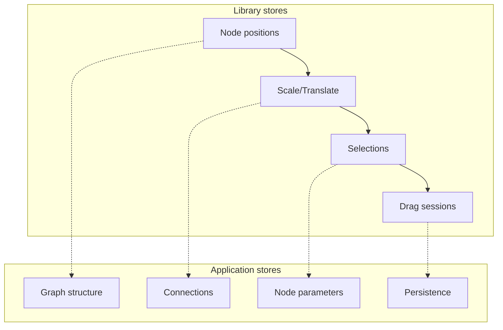

### Inside Foblex Flow — Part 1: Library Architecture and Design Principles

Node-based interfaces are everywhere today: low-code platforms, workflow editors, chatbot builders, business automation systems, ETL tools. Visual logic modeling allows users to “assemble a program” without code by dragging blocks and connecting them with arrows.

But if you work with **Angular**, you’ll quickly face a problem:

- most popular solutions are React-only (e.g., React Flow),
- others are tightly coupled to their own data model,
- or they feel outdated and don’t fit into modern Angular projects.

That’s why we built [**Foblex Flow**](https://flow.foblex.com/) — a library that fills this gap.

- Written entirely in Angular.
- Doesn’t dictate how to store your data.
- Provides a flexible interaction layer.
- Based on a clear, event-driven API.

In this series, we’ll look inside the library — how it works, which principles guide its design, and which architectural decisions make it lightweight and universal.

We’ll start with the foundation: **architecture and design principles**.

<https://github.com/Foblex/f-flow>

### 🎯 The Key Idea: Separation of Responsibilities

Most node-based libraries give you everything “out of the box”: a data store, JSON graph, APIs for saving and loading. That’s convenient at first, but becomes a limitation once you try to integrate it into a real application.

[Foblex Flow](https://flow.foblex.com/) takes a different approach:

- 👉 The library stores **only what’s needed for interactivity and rendering**,
- 👉 Everything else is left to the user.

#### What the library stores

- **Node positions (x, y)** — required for rendering.
- **Canvas scale and translate** — zoom and panning (defaults: scale = 1, translate = {0,0}).
- **Drag session state** — current node coordinates, cursor offsets.
- **Element selection (selected / unselected)** — for highlighting and frames.
- **Internal UI states** — e.g., snap highlight when connecting nodes.

#### What the user stores

- **Graph structure** — which nodes exist, their types and parameters.
- **Connection model** — which links are allowed, validation rules.
- **Node semantics** — what a “Webhook”, “AI Generator” or “Parser” node actually does.
- **Persistence** — saving/loading flows (NgRx, Signals, IndexedDB, Firebase, etc.).
- **Visual styles** — how nodes and connectors look.

> 📌 In short: the library handles the **UI layer**, while your application owns the business logic.

### ⚡ Event-Driven Model

The golden rule of [Foblex Flow](https://flow.foblex.com/): the library **never mutates your data silently**.

Every user action is emitted as an Angular event:

- fNodeMoved — a node was dragged.
- fNodeSelected — a node was selected.
- fConnectionCreated — a new connection was made.
- fConnectionRemoved — a connection was deleted.
- fCanvasChanged— the canvas was changed.

This means every action is a **signal to your application**:

> _“This happened. You decide what to do.”_

That makes the library predictable and easy to integrate with any state management — from Signals to NgRx.

### 🧩 Architectural Layers

We can break down [Foblex Flow](https://flow.foblex.com/) into four layers:

```text
FFlowComponent
 └── FCanvas
      ├── FNodeDirective
      │     ├── FNodeOutputDirective
      │     └── FNodeInputDirective
      │
      └── FConnectionComponent
```

#### **Flow**

The root component (\<f-flow>) — coordinates context, events, and canvas state.

#### **Canvas**

The workspace: holds all nodes and connections. Manages zoom, pan, and selections.

#### **Nodes**

Nodes are not predefined components, but **directives** you can attach to any Angular element.

- fNode — turns an element into a node.
- fNodeOutput — defines an output connector.
- fNodeInput — defines an input connector.

#### Connections

An SVG path connecting an output to an input. Supports Bezier curves, straight lines, and arrows.

### 🔧 Minimal Example

```html
<f-flow>
  <f-canvas>
    <!-- Node 1 -->
    <div fNode fNodeId="node1" [position]="{x: 100, y: 150}">
      <div fNodeOutput fOutputId="out1"></div>
    </div>

    <!-- Node 2 -->
    <div fNode fNodeId="node2" [position]="{x: 400, y: 150}">
      <div fNodeInput fInputId="in1"></div>
    </div>

    <!-- Connection -->
    <f-connection fOutputId="out1" fInputId="in1"></f-connection>
  </f-canvas>
</f-flow>
```

Positions (x, y) are mandatory — without them a node won’t render.

But where and how you store them (Signals, NgRx, Firestore, a plain service) is entirely up to you.

### 🛠 Design Principles

#### 1. Minimal Magic

Instead of hiding complexity behind black boxes, the API is transparent: directives and events are explicit.

#### 2. SSR and Zoneless Angular

[Foblex Flow](https://flow.foblex.com/) works outside the browser.

All window, document, and localStorage references go through DI and can be mocked for SSR.

#### 3. Performance

- No “global JSON graph” that’s recalculated on each change.
- Renders only changed elements.
- Drag-and-drop is optimized for large graphs (hundreds of nodes).

#### 4. Flexibility

- Store flows as JSON if you like.
- Sync with Firebase or GitHub.
- Save to IndexedDB.

The library never dictates your persistence strategy.

### 📐 Visual Diagram



The diagram illustrates the boundary: [Foblex Flow](https://flow.foblex.com/) only handles UI state, while your app owns the graph model and business logic.

### 🧠 Philosophy: UI Handles Interactivity, Not Data

The core philosophy: [Foblex Flow](https://flow.foblex.com/) is not a “platform inside a platform.”

It focuses on what it does best — **interactive UI**.

- The library tells you what the user did.
- Your app decides what it means.

This separation makes the library **universal**. You can build anything — from workflow editors to no-code chatbot builders.

### 🚀 Conclusion

[Foblex Flow](https://flow.foblex.com/) is not a black box — it’s a **transparent tool** for building node-based UIs in Angular.

- It manages interactivity, not your data.
- Gives you full control over business logic.
- Fits projects of any scale, from simple diagrams to complex low-code platforms.

In the next part, we’ll dive into the **drag-and-drop engine**:

- unifying mouse, touch, and pointer events,
- the internal IPointerEvent structure,
- how FDraggableDirective works,
- and how plugins enable extensions like resize, rotate, and external drop.
